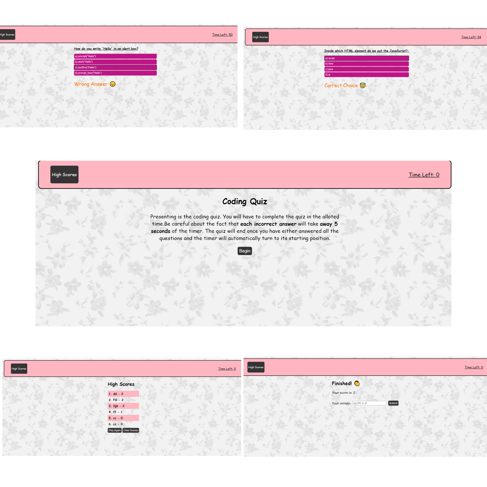

# Code_Quiz_DR
The quiz asks the player some code related questions and increases the score by one for each correct answer or decreases the time by 5 seconds if your answer is incorrect.

## Table of Contents
* [Introduction](#introduction)
* [Screenshot of the Quiz](#webpage)
* [Working of the Application](#web)
* [Installations](#installations)
* [Assignment details](#details)
* [Credits](#credits)

 ## Introduction 
 The quiz asks the player some code related questions. the questions are mainly based on Javascript techniques but it has been made using the concepts of HTML and CSS as well.The code quiz has 5 questions in total that needs to be answered. for each question, four options will be presented and the player has to select one option.Each correct answer increments your score by one and every incorrect answer decreases your working time by 5 seconds.This quiz is designed to play on a larger and a smaller screen format as well.
 
 
 ## Screenshot of the Quiz
 The screenshot of the Quiz looks almost similar to the one as shown here.

 
 
 
 ## Working of the Application
 

The working of the code quiz has been divided into the following parts:

PAGES | FUNCTIONS
------------ | -------------
LANDING PAGE |The quiz asks the player some code related questions. The questions are mainly based on Javascript techniques but it has been made using the concepts of HTML and CSS as well. We start the quiz by clicking the "Begin" button on the landing page along with the data that displays the remaining time and score points accumulated as the quiz progresses.
QUESTIONS PAGE | Once the quiz is started, the user is presented with a question, along with 4 possible answers.For each question, 4 options will be presented and the player has to select the correct option.Each correct answer increments your score by one and every incorrect answer decreases your working time by 5 seconds.
LAST PAGE | Once the user reaches the last question,after clicking an option for it his/her final score is displayed along with a finished prompt. Also, the player is asked to enter their initials if the initials are anything else but alphabets, then he is prompted to enter the correct initials.The current and all the previous scores are stored in the local storage after clicking the Submit button.This list of saved scores can be seen by clicking the "View High Scores" button.

 
 ## Installations
   * [The URL of the Github repo](https://github.com/Dipti2021/Code_Quiz_DR)
   * [The URL of the deployed application](https://dipti2021.github.io/Code_Quiz_DR/)
 
 ## Assignment Details
  The random password generator has been created using HTML, CSS and Javascript to code.The aaplication has been created keeping in mind the following conditions:
   * This application can be used to generate a random password between 8 and 128 characters.
   * It is upto the discretion of the user to choose how they want to construct their password. 
   * The password can be created using uppercase letters, lowercase letters, numeric characters, and special characters.
   * If the number entered by the user does not fall in the given range, then no password will be generated.
   * Depending upon the prompts chosen by the user, the password will be generated accordingly.

  *Keeping all these conditions in mind, I have created the Javascript code using the if, else if and else conditions to generate the required password.On generating a random string of characters, they were joined and presented as a password using functions like*  `.concat()`, `math.floor()` and `math.random()`
    
 
 ## Credits
    The homework has been assigned to me by the Carleton University Coding Bootcamp, our instructor and the TA's
